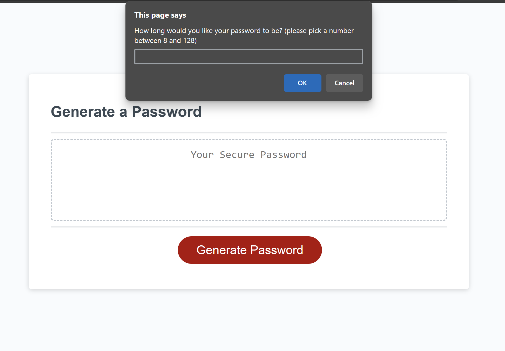

# Password Generator

## Description

This is a password generator that allows the user to generate a password based on the selected options. The min/max password length requirement and other criteria are set to ensure that the password generated has a higher level of security.

## Installation

N/A

## Usage

Begin by clicking on the "Generate Password" button, the user will be prompted with a series of questions about how long would they like their password to be and what character type(s) would they like to include in their password. If the password length entered is within the defined length and at least one character type is selected, the password with the desired parameter will be returned. Password will not be generated if no character type is selected and the user will see an alert as well as a message will be displayed in the text area to let the user know that that password may not be generated. 

Link to the deployed application: https://jasmineleeyt.github.io/password-generator/

Screenshot of the website:

## Credits

Starter code used for this project is from:
https://github.com/coding-boot-camp/friendly-parakeet/tree/main

I used W3Schools & Mozilla to search up the methods and statements to use: 
- https://www.w3schools.com/ 
- https://developer.mozilla.org/en-US/

## License

Please refer to the LICENSE in the repo.
